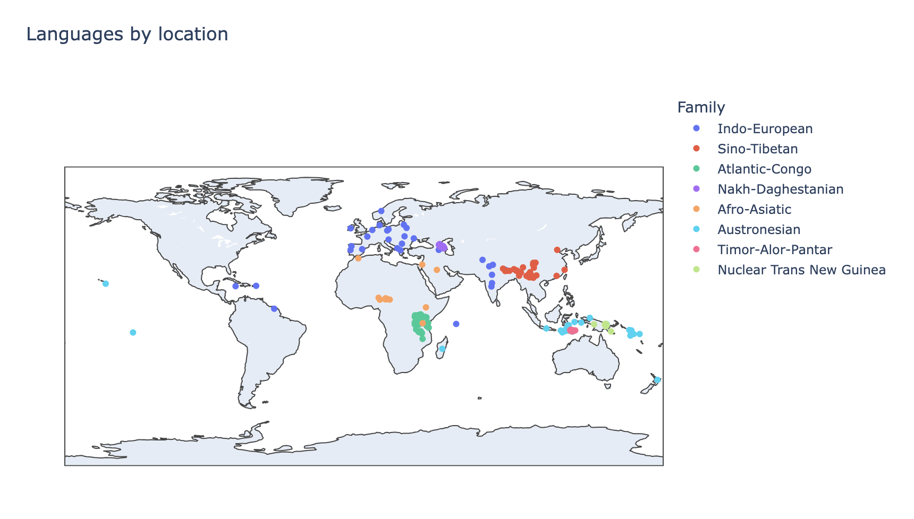
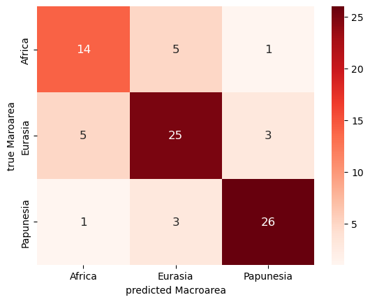
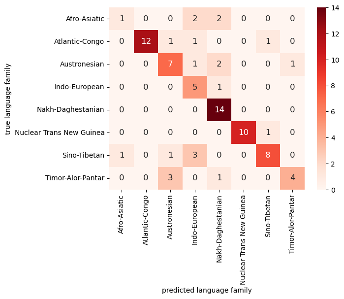

# Colexification Across the Globe
By: Teresa Davison

## Introduction
Colexification is when two or more distinct meanings share the same word form in a language. My original interest in colexification was driven by finding a column in a dataset about the typology of different languages that categorized languages as either having a distinction between the concepts 'hand' and 'arm' or not. As I have learned some Russian, I know that they do not distinguish between 'hand' and 'arm' (*ruka*) or between 'foot' and 'leg' (*noga*). Learning new languages has also made me aware of some colexifications in English, such as '*to know*' having the meaning 'to know facts' and well as 'to be familiar with', a distinction languages like Spanish, Germand and French make. Colexification patterns vary widely across languages and could possibly point to aspects of the culture and environment they developed in. For example, *Geist* in German means both 'soul' and 'mind', which could be a product of the very literal aspect of German culture and lack of ambiguity in their language compared to other languages.

Though investigating individual colexifications is a great source of information for things like linguistic paleontology, it would be difficult to quantitatively analyze differences between languages based solely on this information. By sourcing my data from the [Database of Cross-Linguistic Colexifications](https://clics.clld.org/parameters) or CLICS3, I was able to get thorough information not only on ceoncepts colexified in many different languages but the semantic field and ontological category of these concepts. With this information I will be investigating whether patterns in the types of words being colexified in each language could be used to predict language family or macroarea.

## Data sourcing

The CLICS3 database is an online interface that provides a list of concepts with links to lists of colexified concepts as well as networks of related concepts (subgraphs). In order to do analysis on the data, I extracted the relevant tables from the underlying [SQL database](https://github.com/clics/clics3/blob/master/clics3.sqlite.zip), available on GitHub for download.

The three dataframes I chose to work with were the Language, Form and Parameter dfs. Samples of these can be found in the [data samples folder](https://github.com/Data-Science-for-Linguists-2024/Colexification-Across-the-Globe/tree/main/data_samples). 
1. The Language dataframe contains individual languages, along with macroarea, language family and lat/longitudinal data. The distribution of languages can be seen below in Figure 1. There are:
    - 3,248 languages
    - 6 Macroareas
    - 202 language families

Figure 1. Map of languages represented in the dataset with size corresponding to the number of forms in that language

An interactive version of this map can be found in [this notebook](https://nbviewer.org/github/Data-Science-for-Linguists-2024/Colexification-Across-the-Globe/blob/main/notebooks/Final_pr.ipynb).

2. The Form dataframe contains word forms and connects these forms to the associated concepts as well as the language the form is used in. There are almost 1.5 million forms represented across the different languages. Since the dataset is a collation of 30 different datasets, different datasets have different conventions for inputting forms such as transliteration, IPA, original script. This caused a few small issues.
    
4. The Parameter dataframe contains concepts with unique IDs called Concepticon IDs as they use the concept-definition standard proposed in the Tenth International Conference on Language Resources and Evaluation. There is also an English gloss, semantic field, and ontological category for each concept. There are over 2900 concepts represented with information on semantic field and ontologica category for each. The distributions for these concept types can be seen below in Figures 2 and 3.

Figure 2. Distribution of semantic field among concepts

Figure 3. Distribution of ontological category among concepts

## Analysis

### Sampling

Given these data, I decided to sample the languages to pick a smaller number of language families to classify. I choose languages from language families with over 30 languages that had lat/longitude, macroarea, and family info, as well as more than 600 forms to ensure that there would be data for the models to work with. The resulting sample included 30 languages from the Indo-European, Sino-Tibetan, Atlantic-Congo, Nakh-Daghestanian, Austronesian, and Nuclear Trans New Guinea families as well as 17 Timor-Alor-Pantar and 13 Afro-Asiatic languages, seen below in Figure 4. Additionally, I decided to exclude the 3 languages in the Americas since they are not a large enough sample to predict those macroareas accurately. Therefore, any results will apply only to the Eastern Hemisphere and those 8 language families.

Figure 4. Distribution of sampled languages geographically

### Feature Extraction

In order to have features to feed the models, I had to first create dataframes containing colexifications for each language in the sample. This was done by isolating the forms for a specific language then finding forms that had 2 concepts mapping to them. Then I added the semantic field and ontological category for the pairs of concepts. Finally, I created counts for each of the possible semantic field and ontological category pairs and consolodated this information into one dataframe for all of the languages in the sample. An annotated version of the resulting feature dataframes can be found in slides 10 and 11 of the [presentation](https://github.com/Data-Science-for-Linguists-2024/Colexification-Across-the-Globe/blob/main/LING1340FinalPresentation.pdf). 

### Model Evaluation

I fitted models with 4 different combinations of predictors (X) and response variables (y) for classification. I evaluated them in terms of accuracy:

1. X: Semantic field, y: Macroarea
    - Naive Bayes: 0.783
    - RandomForest: 0.639
    - SVC: 0.762
2. X: Ont category, y: Macroarea
    - Naive Bayes: 0.610
4. X: Semantic field, y: Language family
    - Naive Bayes: 0.735
6. X: Ont category, y: Language family
    - Naive Bayes: 0.505
  
Overall, the models performed better than I had expected. If the models had chosen the largest group and classified every observation as being a part of it, the accuracy for Macroarea as y would be 42.5%. This is called a prior. The prior for Language family as y would be 14.3%. All of the models improved on this to a degree, showing that there is some relationship between the types of concepts being colexified and language family or macroarea. Overall, the Naive Bayes model worked the best and the semantic field proved to be the most useful. This makes sense since the semantic field is much more nuanced than the ontological category. 

As we can see in figure 5, there is some confusion between Eurasia and the other two areas. This could be because Eurasia is geographically close to both areas and the languages that represent it have had contact with languages in the other areas. Africa and Papunesia, however, are not geographically close and are not confused often by the model.

Figure 5. Confusion matrix for X: Semantic field, y: Macroarea using Naive Bayes

For the misclassification of language families, it is more difficult to see obvious patterns. Some of the trouble seems to come from the language families that had smaller representations (Afro-Asiatic and Timor-Alor-Pantar). 

Figure 6. Confusion matrix for X: Semantic field, y: Language family using Naive Bayes

From the most important features for these two models, 

## Future Inquiry

There are packages to recreate the CLICS3 networks on a local machine using Python. Using Network theory, these could then be analyzed to give more information about the relationships between concepts. I am not currently well-versed on graph theory, however, suing the data in this form could lead to more nuanced analysis on the relationships between languages based on the concepts they colexify or research on the similarity of concepts in general.

