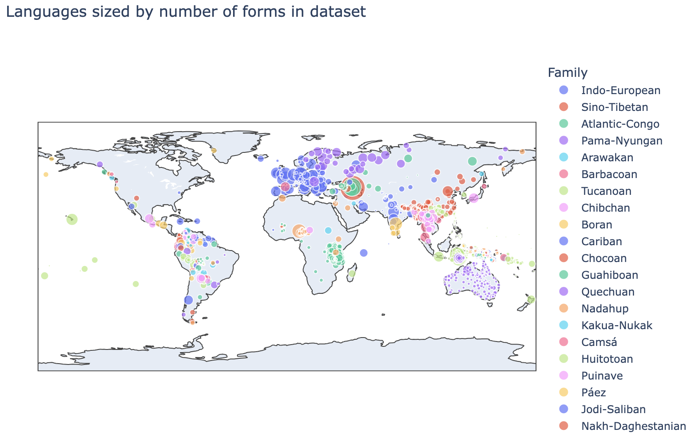
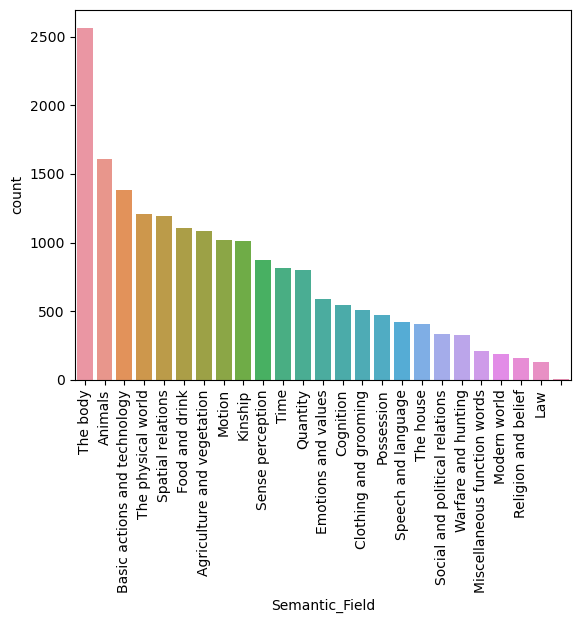
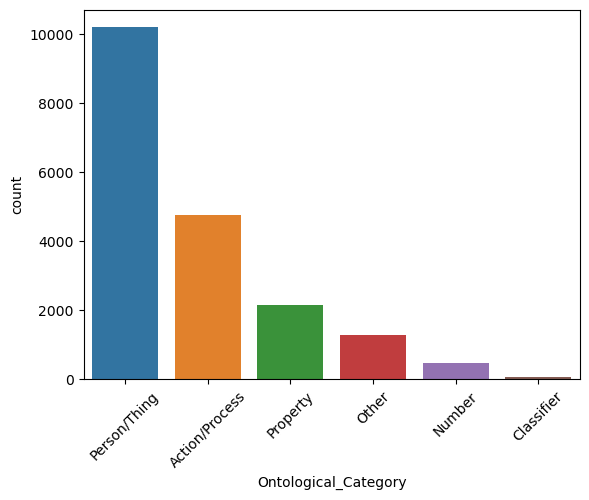

# Colexification Across the Globe
By: Teresa Davison

## Introduction
Colexification is when two or more distinct meanings share the same word form in a language. My original interest in colexification was driven by finding a column in a dataset about the typology of different languages that categorized languages as either having a distinction between the concepts 'hand' and 'arm' or not. As I have learned some Russian, I know that they do not distinguish between 'hand' and 'arm' (*ruka*) or between 'foot' and 'leg' (*noga*). Learning new languages has also made me aware of some colexifications in English, such as '*to know*' having the meaning 'to know facts' and well as 'to be familiar with', a distinction languages like Spanish, Germand and French make. Colexification patterns vary widely across languages and could possibly point to aspects of the culture and environment they developed in. For example, *Geist* in German means both 'soul' and 'mind', which could be a product of the very literal aspect of German culture and lack of ambiguity in their language compared to other languages.

Though investigating individual colexifications is a great source of information for things like linguistic paleontology, it would be difficult to quantitatively analyze differences between languages based solely on this information. By sourcing my data from the [Database of Cross-Linguistic Colexifications](https://clics.clld.org/parameters) or CLICS3, I was able to get thorough information not only on ceoncepts colexified in many different languages but the semantic field and ontological category of these concepts. With this information I will be investigating whether patterns in the types of words being colexified in each language could be used to predict language family or macroarea.

## Data sourcing

The CLICS3 database is an online interface that provides a list of concepts with links to lists of colexified concepts as well as networks of related concepts (subgraphs). In order to do analysis on the data, I extracted the relevant tables from the underlying [SQL database](https://github.com/clics/clics3/blob/master/clics3.sqlite.zip), available on GitHub for download.

The three dataframes I chose to work with were the Language, Form and Parameter dfs. Samples of these can be found in the [data samples folder](https://github.com/Data-Science-for-Linguists-2024/Colexification-Across-the-Globe/tree/main/data_samples). 
1. The Language DF contains individual languages, along with macroarea, language family and lat/longitudinal data. There are:
    - 3,248 languages
    - 6 Macroareas
    - 202 language families

A interactive version of this map can be found in [this notebook](https://nbviewer.org/github/Data-Science-for-Linguists-2024/Colexification-Across-the-Globe/blob/main/notebooks/Final_pr.ipynb).

2. The Form DF contains word forms and connects these forms to the associated concepts as well as the language the form is used in. There are almost 1.5 million forms represented across the different languages. Since the dataset is a collation of 30 different datasets, different datasets have different conventions for inputting forms such as transliteration, IPA, original script. This caused a few small issues.
    
4. The Parameter DF contains concepts with unique IDs called Concepticon IDs as they use the concept-definition standard proposed in the Tenth International Conference on Language Resources and Evaluation. There is also an English gloss, semantic field, and ontological category for each concept. There are over 2900 concepts represented with information on semantic field and ontologica category for each. The distributions for these concept types can be seen below.

## Future Inquiry

There are packages to recreate the CLICS3 networks on a local machine using Python. Using Network theory, these could then be analyzed to give more information about the relationships between concepts. I am not currently well-versed on graph theory, however, suing the data in this form could lead to more nuanced analysis on the relationships between languages based on the concepts they colexify or research on the similarity of concepts in general.

